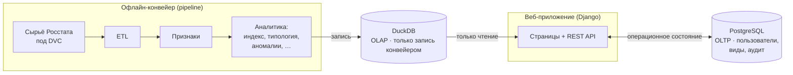

# RegionLens

**Приложение для анализа социально-экономических показателей регионов России по данным Росстата.**

RegionLens собирает открытые данные Росстата, приводит их к сопоставимому виду и заранее (офлайн) рассчитывает аналитику — композитный индекс развития, типологию регионов, сходимость, аномалии, статистических «двойников» и другое, — а веб-приложение отдаёт результаты через интерактивную карту, рейтинги, сравнение регионов и REST API.


---

## Ключевые возможности

- **Интерактивная карта** регионов (MapLibre GL) с раскраской по любому показателю и году; при наведении подсвечиваются границы субъекта.
- **Композитный индекс развития** в трёх схемах взвешивания — равные веса, PCA и экспертные — с проверкой устойчивости рейтинга.
- **Типология регионов**: кластеризация по годам со стабильными во времени метками и SHAP-объяснением принадлежности.
- **Динамика и неравенство**: β- и σ-сходимость, межрегиональный разброс, стабильность рейтинга по годам.
- **Диагностика**: пространственные аномалии и структурные сдвиги, парные корреляции, декомпозиция изменения индекса по доменам, качество данных.
- **Статистические «двойники»** региона — ближайшие по профилю показателей.
- **Экспорт графиков** в PNG и SVG из панели инструментов любой диаграммы; экспорт отчётов по региону в XLSX/DOCX.
- **Быстрый поиск** по регионам, показателям и страницам (иконка в шапке, горячая клавиша `Ctrl`/`⌘`+`K`).
- **Личный кабинет**: сохранённые виды (с публичным шарингом), избранное, наборы сравнения, история и центр экспорта (xlsx/docx), журнал действий с возможностью очистки.
- **REST API** с автодокументацией OpenAPI/Swagger, версионированием (`/api/v1/`), ограничением частоты запросов и токен-аутентификацией.
- **Роли доступа**: `viewer` ⊂ `analyst` ⊂ `admin`.
- **Интернационализация** интерфейса (ru/en) и тёмная тема.

---

## Архитектура: «два мира»

В основе платформы — строгое разделение операционного и аналитического хранилищ. Это ключевой инвариант всего проекта.



- **OLAP — DuckDB (только чтение).** Вся предрассчитанная аналитика и справочники. В этот файл пишет **исключительно** офлайн-конвейер; приложение открывает его строго read-only.
- **OLTP — PostgreSQL (через Django ORM).** Изменяемое операционное состояние: пользователи, профили, сохранённые виды, избранное, наборы сравнения, задания экспорта, журнал аудита.

Операционные записи хранят **только конфигурацию** (год, ОКАТО, схема весов, мера), но не сами данные: при открытии сохранённого вида экран каждый раз перечитывается из DuckDB. Такое разделение делает хранилище аналитики заменяемым и гарантирует воспроизводимость.

---

## Технологический стек

| Слой | Технологии |
|---|---|
| Бэкенд | Python 3.12+, Django 5.2, Django REST Framework, drf-spectacular |
| Хранилища | PostgreSQL (OLTP), DuckDB (OLAP) |
| Аналитика | polars, pandas, scikit-learn, scipy, statsmodels, SHAP, ruptures |
| Данные и трекинг | DVC (версионирование данных), MLflow (эксперименты), pandera (контракты) |
| Фронтенд | Django-шаблоны, ванильный JS, Alpine.js, Plotly, MapLibre GL |
| Логи | structlog (структурные логи со сквозным request-id) |
| Качество | ruff, mypy (strict), pytest, pre-commit, pip-audit, locust |

---

## Быстрый старт

Нужны Python 3.12+, PostgreSQL (проще всего через Docker) и [git-lfs](https://git-lfs.com/)
(аналитическое хранилище DuckDB версионируется через Git LFS).

```bash
# 1. Установить git-lfs и получить репозиторий (DuckDB подтянется через LFS)
git lfs install
git clone <URL-репозитория> && cd RegionLens

# 2. Окружение
cp .env.example .env        # при необходимости отредактируйте

# 3. База данных (OLTP)
docker compose up -d postgres

# 4. Запуск «из коробки»: установка → миграции → демо-данные → проверка
make bootstrap

# 5. Запуск веб-приложения
python main.py              # http://localhost:8000
```

После `make bootstrap` доступны демонстрационные учётные записи трёх ролей:
`demo_viewer` / `demo_analyst` / `demo_admin` (пароли — в выводе команды).
Адрес и порт можно переопределить переменной `REGIONLENS_ADDRPORT`.

### Пересборка аналитики из сырья

Файл DuckDB поставляется через Git LFS, но всегда воспроизводится из сырья:

```bash
dvc pull                    # получить сырьё (если настроен DVC-remote)
make pipeline               # пересобрать всю аналитику: python -m pipeline.run_all
```

### Через Docker

```bash
docker compose up -d --build   # PostgreSQL + backend
```

---

## Структура проекта

```
RegionLens/
├── main.py                 # точка входа веб-приложения
├── backend/                # Django-приложение
│   ├── config/             # настройки, корневые URL
│   ├── core/               # модели (OLTP), представления, API, запросы к DuckDB
│   ├── templates/          # серверные HTML-шаблоны
│   ├── static/             # JS (карта, графики), CSS
│   └── locale/             # переводы ru/en
├── pipeline/               # офлайн-конвейер аналитики
│   ├── ingestion/          # адаптеры источников данных
│   ├── etl.py              # сырьё → справочники и факты
│   ├── features.py         # гармонизация, ядро, импутация, z-score
│   ├── typology.py         # кластеризация + SHAP
│   ├── dev_index.py        # композитный индекс развития
│   ├── contracts.py        # pandera-контракты таблиц DuckDB
│   └── run_all.py          # оркестратор конвейера
├── config/                 # YAML-конфиги аналитики (веса, пороги, домены)
├── data/                   # сырьё (DVC) и генерируемое хранилище DuckDB
├── tests/                  # pytest (юнит + интеграционные + нагрузочные + e2e)
├── docker-compose.yml
├── Makefile
└── pyproject.toml
```

---

## Конвейер аналитики

Конвейер воспроизводимо пересобирает всю аналитику из сырья. Каждая стадия читает контрактные таблицы из DuckDB и пишет свои результаты туда же.

```bash
python -m pipeline.run_all              # весь конвейер: сырьё → DuckDB
python -m pipeline.run_all --list       # показать план стадий и их таблицы
python -m pipeline.run_all --from typology   # пересобрать с указанной стадии до конца
python -m pipeline.run_all --only twins      # пересобрать ровно одну стадию
```

Основные стадии: ETL (справочники и факты) → признаки (ядро, импутация, z-score) → типология (кластеры + SHAP) → индекс развития (3 схемы весов) → переходы и траектории типов → статистические двойники → стабильность рейтинга → дисперсия и σ-сходимость → β-сходимость → парные корреляции → декомпозиция индекса → аномалии → качество данных.

Параметры аналитики (окно, пороги, веса, число кластеров) вынесены в `config/*.yaml` — без хардкода в коде. Контракты таблиц (`pipeline/contracts.py`) валидируются через pandera по принципу «падение валидации = падение конвейера».

---

## Веб-интерфейс

Публичные страницы: главная, карта, explore-режим, рейтинги, лаборатория индекса, сходимость, стабильность рейтинга, типология, сравнение регионов, список и карточка региона, методология, данные, качество данных, неравенство/дисперсия, аномалии, корреляции, справка.

Личный кабинет (после входа): обзор, профиль, сохранённые виды с публичным шарингом, избранное, наборы сравнения, центр экспорта и история, лента действий, настройки по умолчанию.

---

## REST API

Канонический префикс всех эндпойнтов — `/api/v1/` (неверсионированный `/api/` сохранён для обратной совместимости). Интерактивная документация — Swagger UI, схема — OpenAPI:

- `GET /api/v1/docs/` — Swagger UI
- `GET /api/v1/schema/` — OpenAPI-схема

Примеры эндпойнтов: `geo/layer/` (слой карты), `regions/`, `regions/<okato>/` (карточка региона), `index/` (рейтинг по индексу), `index/robustness/`, `dispersion/`, `beta/`, `typology/`, `transitions/`, `compare/`, `anomalies/`, `correlations/`, `decomposition/`, `data-quality/`, `metrics/`. Часть аналитических эндпойнтов открытых данных публична; операции кабинета требуют входа. Аутентификация по токену — заголовок `Authorization: Token <ключ>` (токен выдаётся в кабинете, в БД хранится только его SHA-256-хеш). Действует ограничение частоты запросов (`THROTTLE_ANON`/`THROTTLE_USER`).

---

## Конфигурация

Настройки читаются из окружения (см. `.env.example`):

| Переменная | Назначение |
|---|---|
| `DJANGO_SECRET_KEY` | Секретный ключ Django (в проде — длинный случайный) |
| `DJANGO_DEBUG` | Режим отладки (`true`/`false`) |
| `DJANGO_ALLOWED_HOSTS` | Разрешённые хосты (через запятую) |
| `DJANGO_CSRF_TRUSTED_ORIGINS` | Доверенные источники для форм за HTTPS-прокси, со схемой (например, `https://regionlens.example.com`) — обязательно в проде |
| `DATABASE_URL` | Строка подключения к PostgreSQL |
| `DUCKDB_PATH` | Путь к аналитическому файлу DuckDB |
| `MODELS_DIR` | Каталог обученных ML-моделей (карточки читает витрина «Модели») |
| `REDIS_URL` | Кэш в проде (общий для воркеров; при пустом значении — локальный кэш процесса) |
| `THROTTLE_ANON` / `THROTTLE_USER` | Лимиты частоты запросов API для анонимов / по токену |

При `DJANGO_DEBUG=false` автоматически включаются HTTPS-редирект, secure-cookies и HSTS — боевые настройки безопасности проходят `python backend/manage.py check --deploy` без замечаний. Полный чек-лист развёртывания на VPS (gunicorn + WhiteNoise + nginx, миграции, роли, компиляция переводов) — в [`docs/DEPLOY.md`](docs/DEPLOY.md).

> **Важно при развёртывании за обратным прокси на своём домене:** задайте `DJANGO_CSRF_TRUSTED_ORIGINS` — без него POST-формы (вход, смена языка, избранное) вернут 403. Если TLS терминируется прокси, оставьте `DJANGO_TRUST_PROXY_SSL=true` (по умолчанию в проде), а прокси должен передавать заголовок `X-Forwarded-Proto`.

---

## Разработка

```bash
make install    # установка проекта со всеми группами зависимостей
make lint       # ruff check + ruff format --check
make format     # автоформат и автофиксы
make type       # mypy (strict)
make test       # pytest (браузерные e2e исключены из прогона по умолчанию)
make e2e        # браузерные сценарии Playwright (первый запуск скачает chromium)
make audit      # pip-audit — аудит зависимостей на уязвимости
make load       # нагрузочный замер locust (нужен поднятый сервер)
```

Перед коммитом рекомендуется установить pre-commit-хуки (ruff, mypy, гигиенические проверки):

```bash
pre-commit install
pre-commit run --all-files
```

Непрерывная интеграция (GitHub Actions) прогоняет линт, форматирование, проверку типов, валидацию OpenAPI-схемы, тесты и браузерные e2e-сценарии (Playwright) на каждый push.

---

## Данные

Исходные данные — открытая статистика Росстата. Сырьё версионируется через **DVC** (в git хранятся только указатели, сами данные — во внешнем хранилище). Промежуточные и итоговые таблицы, а также файл DuckDB, в репозитории не хранятся: они детерминированно пересоздаются конвейером.

---

## Автор

Кузьмин Евгений Олегович.
