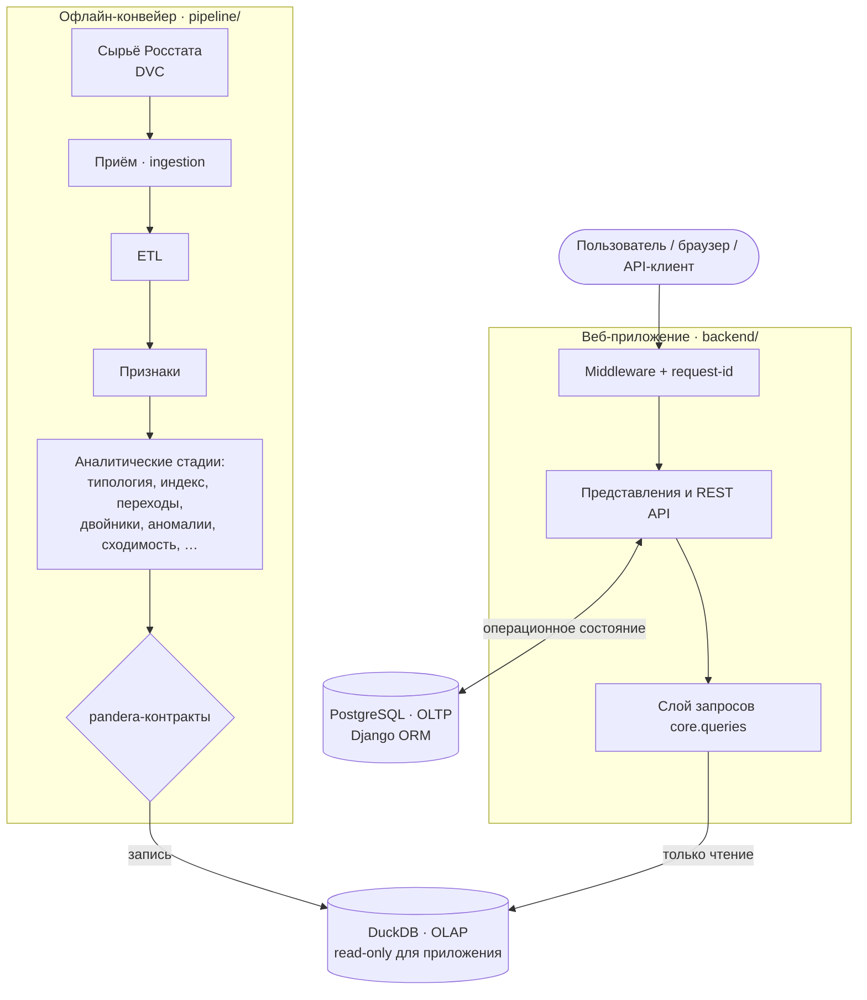
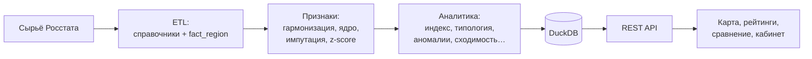
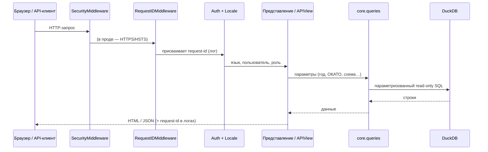
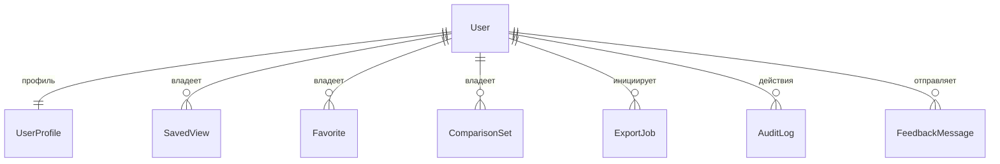

# Архитектура RegionLens

Документ описывает архитектуру платформы: структуру, потоки данных, ключевые решения и их обоснование. Он дополняет `README.md` (обзор и запуск) и `DATA_DICTIONARY.md` (описание таблиц).

---

## 1. Назначение и контекст

RegionLens — платформа анализа и визуализации социально-экономических показателей регионов РФ по данным Росстата. Система решает две разные по природе задачи:

- **Аналитические расчёты** (индекс развития, кластеризация, аномалии, сходимость) — редкие, ресурсоёмкие, воспроизводимые из сырья.
- **Интерактивное обслуживание пользователей** — частые, лёгкие, только чтение готовой аналитики + операционное состояние (виды, избранное, аудит).

Эти задачи разведены архитектурно: расчёты выполняет офлайн-конвейер и складывает результат в аналитическое хранилище, а веб-приложение только читает его. Это центральное решение всей системы.

---

## 2. Архитектурные драйверы (атрибуты качества)

| Драйвер | Как обеспечивается |
|---|---|
| **Воспроизводимость** | Вся аналитика пересобирается из сырья одной командой; параметры — в YAML; данные — под DVC. |
| **Целостность данных** | Контракты pandera на каждую таблицу; принцип «падение валидации = падение конвейера». |
| **Разделение ответственности** | «Два мира»: приложение не пишет в аналитическое хранилище. |
| **Безопасность** | Настройки из окружения, RBAC, автоматическое ужесточение в проде, параметризованный SQL. |
| **Наблюдаемость** | Структурные логи (structlog) со сквозным request-id. |
| **Производительность чтения** | Предрасчёт всей аналитики офлайн; приложение выполняет только быстрые read-only запросы. |
| **Объяснимость** | Каждый аналитический вывод сопровождается методом, весами, вкладом, SHAP. |

---

## 3. Обзор архитектуры: «два мира»



- **OLAP — DuckDB (read-only).** Витрина всей предрассчитанной аналитики и справочников. Пишет только конвейер; приложение открывает файл строго на чтение.
- **OLTP — PostgreSQL (Django ORM).** Изменяемое операционное состояние: пользователи, профили, сохранённые виды, избранное, наборы сравнения, задания экспорта, журнал аудита.
- **MLflow** — трекинг экспериментов конвейера; **DVC** — версионирование сырья.

Ключевой инвариант: операционные записи хранят только **конфигурацию** (год, ОКАТО, схема весов, мера), но не сами данные — при открытии сохранённого вида экран перечитывается из DuckDB.

---

## 4. Поток данных



От сырья до экрана данные проходят: приведение к сопоставимому виду (метрика = код показателя × подкатегория, ключ региона — ОКАТО, при дублях берётся свежайшее издание), формирование признаков (импутация с гейтом по доле, z-score), расчёт аналитики по YAML-параметрам, валидацию контрактами и запись в DuckDB, откуда приложение читает данные для API и интерфейса.

---

## 5. Компоненты

### 5.1. Офлайн-конвейер (`pipeline/`)

Оркеструется `pipeline/run_all.py`; каждая стадия читает контрактные таблицы из DuckDB и пишет свои. Поддерживается частичная пересборка (`--from`, `--only`, `--list`).

Стадии (в порядке зависимостей): `etl` → `features` → `typology` → `dev_index` → `transitions` → `twins` → `anomalies` → `dispersion` → `rank_stability` → `rank_robustness` → `scheme_agreement` → `index_dispersion` → `beta_convergence` → `spatial` → `correlations` → `index_decomposition` → `data_quality` → `metric_catalog`.

Контракты таблиц (`pipeline/contracts.py`) — единый источник схем; валидация через pandera по принципу «падение валидации = падение конвейера».

### 5.2. Хранилища

- **DuckDB (OLAP).** Колоночная встраиваемая СУБД, идеальна для аналитических запросов только на чтение. Доступ приложения — `backend/core/duck.py`: кэшированное на процесс read-only соединение с отдельным курсором на запрос (потокобезопасное конкурентное чтение).
- **PostgreSQL (OLTP).** Операционные данные через Django ORM.

### 5.3. Приложение (`backend/`)

- `config/` — настройки (из окружения), корневая маршрутизация.
- `core/models.py` — 7 OLTP-моделей.
- `core/views.py`, `core/cabinet.py` — серверные представления публичных страниц и личного кабинета.
- `core/api/` — 25 REST-эндпойнтов (DRF) + OpenAPI/Swagger (drf-spectacular).
- `core/queries.py` — единственный слой доступа к DuckDB (контракт раньше кода, параметризованный SQL).
- `core/permissions.py`, `core/middleware.py`, `core/audit.py`, `core/signals.py` — доступ, request-id, аудит, сигналы.

### 5.4. Фронтенд (`backend/templates/`, `backend/static/`)

Серверный рендеринг Django + прогрессивный ванильный JS: Alpine.js (реактивность), Plotly (графики), MapLibre GL (карта). Без сборочного шага и SPA-фреймворка.

---

## 6. Жизненный цикл запроса



Цепочка middleware: `SecurityMiddleware` → `RequestIDMiddleware` → сессии → локаль → common → CSRF → аутентификация → сообщения → clickjacking-защита.

---

## 7. Модель данных

### 7.1. OLTP (PostgreSQL, Django ORM)



Семь моделей: `UserProfile` (настройки по умолчанию), `SavedView` (сохранённый вид, с публичным шарингом по токену), `Favorite` (закладки на регионы/показатели), `ComparisonSet` (именованные группы регионов), `ExportJob` (задания экспорта и путь к файлу), `AuditLog` (журнал действий), `FeedbackMessage` (обратная связь). Все хранят только конфигурацию/состояние, не аналитические данные.

### 7.2. OLAP (DuckDB)

Справочники и факты: `region_dim`, `metric_dim`, `fact_region`, `features_wide`.
Аналитика: `dev_index`, `clusters`, `cluster_profile`, `cluster_shap`, `transitions`, `region_twins`, `anomalies`, `dispersion`, `rank_stability`, `rank_robustness`, `scheme_agreement`, `index_dispersion`, `beta_convergence`, `moran_global`, `moran_local`, `correlations`, `index_decomposition`, `data_quality`, `metric_catalog`.

Подробные схемы — в `DATA_DICTIONARY.md` и `pipeline/contracts.py`.

---

## 8. Ключевые архитектурные решения (ADR)

### ADR-1. Разделение OLTP и OLAP («два мира»)
**Контекст:** аналитические расчёты тяжёлые и редкие; обслуживание пользователей — частое и лёгкое.
**Решение:** предрассчитывать аналитику офлайн-конвейером в DuckDB (read-only), операционное состояние держать в PostgreSQL.
**Альтернативы:** считать аналитику на лету в запросе (медленно, невоспроизводимо); хранить всё в одной СУБД (смешение ответственности).
**Последствия:** быстрые чтения, воспроизводимость, заменяемость аналитического хранилища; цена — необходимость пересборки конвейера при обновлении данных.

### ADR-2. DuckDB как аналитическое хранилище
**Решение:** колоночная встраиваемая СУБД без отдельного сервера.
**Альтернативы:** ClickHouse/PostgreSQL-аналитика (избыточная инфраструктура для одного файла-витрины).
**Последствия:** простое развёртывание, высокая скорость аналитических запросов; ограничение — один писатель (это и есть конвейер).

### ADR-3. Контракты данных раньше кода (pandera)
**Решение:** каждая таблица описана контрактом; валидация останавливает конвейер при нарушении.
**Последствия:** «тихие грязные данные» невозможны; схемы — единый источник правды.

### ADR-4. Серверный рендеринг + прогрессивный JS вместо SPA
**Решение:** Django-шаблоны + Alpine/Plotly/MapLibre.
**Альтернативы:** React/Vue SPA (сложнее в поддержке, требует сборки и отдельного API-контура для всего).
**Последствия:** простота, отсутствие сборочного шага, быстрый первый рендер; интерактив там, где он нужен.

### ADR-5. Конфигурация аналитики в YAML
**Решение:** веса, пороги, окно, число кластеров — в `config/*.yaml`.
**Последствия:** параметры меняются без правки кода; воспроизводимость и прозрачность методологии.

### ADR-6. Роли через штатные Django Groups
**Решение:** `viewer ⊂ analyst ⊂ admin` на группах и правах.
**Последствия:** стандартный, проверенный механизм; аналитические эндпойнты закрываются ролью.

---

## 9. Безопасность и контроль доступа

- Настройки из окружения; предохранитель против дефолтного `SECRET_KEY` в проде.
- При `DEBUG=false` автоматически включаются HTTPS-редирект, HSTS, secure-cookies (чистый `check --deploy`).
- Ролевой доступ: публичные страницы, `analyst` (расширенная аналитика), `admin` (админка).
- Параметризованный SQL везде; пользовательский ввод не попадает в текст запроса.
- Журнал аудита действий; сквозной request-id в логах.

---

## 10. Наблюдаемость и эксплуатация

- **Логи:** structlog, структурные, с request-id (middleware) — сквозная трассировка запроса.
- **Метрики:** Prometheus (`django-prometheus`, эндпоинт `/metrics`); дашборды — Grafana (профиль `monitoring` в проде).
- **Трекинг ошибок:** Sentry / self-hosted GlitchTip — опционально, включается `SENTRY_DSN` (без PII).
- **Трекинг экспериментов:** MLflow (метрики и параметры стадий конвейера).
- **Health-check:** эндпоинт `/healthz/` (проверяется nginx и Docker healthcheck).
- **Пересборка:** `python -m pipeline.run_all` (полностью или частично) — воспроизводимо; в проде запускается вручную или автоматически (systemd path-unit по появлению выгрузки).

---

## 11. Технологический стек и обоснование

| Слой | Технология | Почему |
|---|---|---|
| Веб-фреймворк | Django 5.2 | Зрелость, ORM, админка, аутентификация, i18n «из коробки». |
| API | DRF + drf-spectacular | Стандартный REST + автогенерация OpenAPI/Swagger. |
| OLAP | DuckDB | Быстрая аналитика на чтение без отдельного сервера. |
| OLTP | PostgreSQL | Надёжная реляционная СУБД для операционных данных. |
| Аналитика | polars, scikit-learn, scipy, statsmodels | Производительная обработка и статистические/ML-методы. |
| Объяснимость | SHAP | Интерпретация принадлежности к кластерам. |
| Данные/эксперименты | DVC, MLflow | Версионирование данных и трекинг моделей. |
| Контракты | pandera | Валидация схем таблиц. |
| Фронтенд | Alpine.js, Plotly, MapLibre GL | Реактивность, графики, карта без сборочного шага. |
| Логи | structlog | Структурные логи с request-id. |
| Наблюдаемость | Prometheus/Grafana, Sentry/GlitchTip | Метрики и дашборды; трекинг ошибок (опционально). |

---

## 12. Развёртывание

**Разработка:** `docker-compose.yml` (PostgreSQL + backend); DuckDB собирается конвейером.
**Продакшн:** `docker-compose.prod.yml` — nginx (TLS-терминация, отдача статики), gunicorn-приложение (прод-Dockerfile multi-stage, whitenoise), PostgreSQL, Redis-кэш, профиль `monitoring` (Prometheus + Grafana). Health-check, автоприменение миграций при старте. Секреты — через переменные окружения (`.env`); при `DEBUG=false` боевые настройки безопасности (HTTPS-редирект, secure-cookies, HSTS) включаются автоматически и проверяются `manage.py check --deploy`. Подробности — [DEPLOY.md](DEPLOY.md).

---

## 13. Карта каталогов

```
RegionLens/
├── main.py                 # точка входа веб-приложения
├── backend/
│   ├── config/             # настройки, корневые URL
│   ├── core/
│   │   ├── models.py       # OLTP-модели
│   │   ├── views.py        # публичные страницы
│   │   ├── cabinet.py      # личный кабинет
│   │   ├── api/            # REST-эндпойнты + OpenAPI
│   │   ├── queries.py      # слой доступа к DuckDB
│   │   ├── duck.py         # read-only соединение с DuckDB
│   │   ├── permissions.py  # роли и доступ
│   │   ├── middleware.py   # request-id
│   │   ├── audit.py        # журнал действий
│   │   └── reports.py      # экспорт xlsx / docx
│   ├── templates/          # серверные шаблоны
│   ├── static/             # JS (карта, графики), CSS
│   └── locale/             # переводы ru/en
├── pipeline/
│   ├── ingestion/          # адаптеры источников
│   ├── etl.py, features.py, typology.py, dev_index.py, …
│   ├── contracts.py        # pandera-контракты таблиц
│   └── run_all.py          # оркестратор
├── config/                 # YAML-параметры аналитики
├── data/                   # сырьё (DVC) + генерируемый DuckDB
├── tests/                  # pytest (юнит + интеграционные + нагрузочные)
└── docs/                   # README, ARCHITECTURE, DATA_DICTIONARY, планы
```
